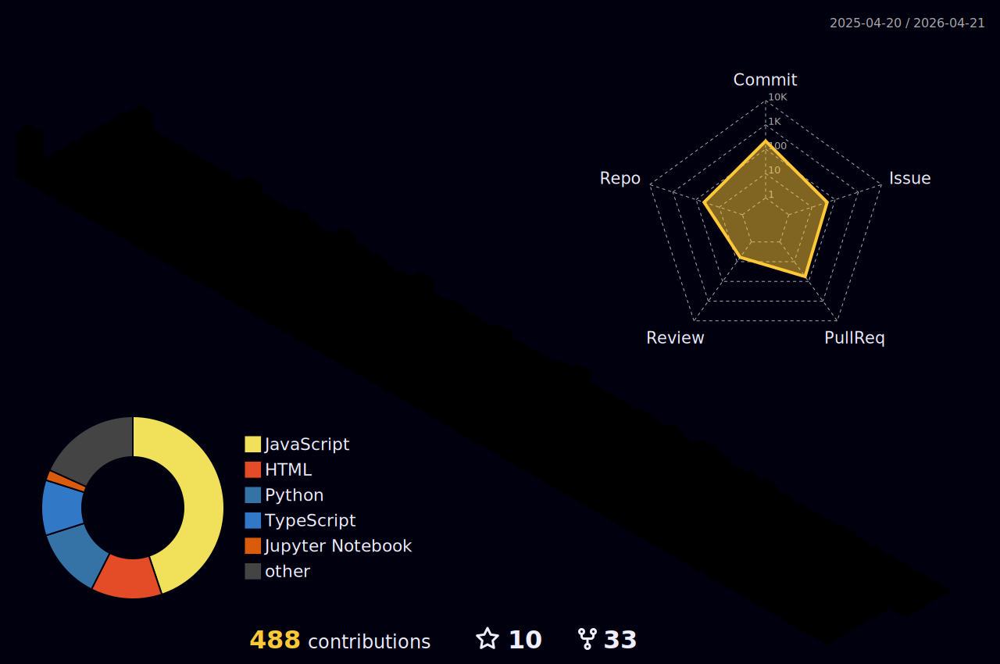

# 🚀 Hey there, I'm Suryansh Rai! 
### *Multi-Domain Engineer | AI Security Researcher | Hardware Hacker*

<div align="center">


<!-- HERO: VIDEO -->
<video src="./assets/github.mp4" autoplay loop muted width="100%" style="border-radius: 10px; margin-top: 15px; margin-bottom: 15px;"></video>

<a href="https://git.io/typing-svg">
  
</a>

<p>
  <a href="https://github.com/Suryansh-RAI">
    
  </a>
  <a href="mailto:suryanshrai14042003@gmail.com">
    
  </a>
  <a href="https://www.linkedin.com/in/suryansh-rai">
    
  </a>
</p>


</div>

---

## 🌟 About Me

```python
class SuryanshEngineer:
    def __init__(self):
        self.name = "Suryansh Rai"
        self.roles = [
            "AI Security Researcher", "Offensive Security", "API Security", "API PenTest",
            "AI Full Stack Engineer", "ML Engineer",
            "Hardware Hacker"
        ]
        self.domains = [
            "Frontend", "Backend", "Artificial Intelligence", 
            "Machine Learning", "Chatbots", "Deepfake Tech", 
            "Offensive Security", "Linux", "AI Security", 
            "Networking", "Radio Frequency", "Hardware Hacking", 
            "Autonomous Vehicles"
        ]
        
        self.current_projects = ["Tri-Netra", "Babua-Bihari", "AI Community Lucknow"]
        self.location = "🇮🇳 India"
        self.specialties = ["Offensive Security", "Hardware Hacking", "API Pentesting", "AI/ML Security"]
        self.learning_focus = ["Deepfake Tech", "Autonomous Vehicles", "RF Hacking"]
        self.quirky_trait = "Has a very long readers block (but breaks systems like lightning!)"
        

    def objective(self):
        return "Exploring the intersection of software, hardware, and AI security. 🛡️"
    
    def my_superpower(self):
        return "I build robust systems, and I know exactly how to break them! 💥"
    
    def current_mission(self):
        return "Pushing the boundaries of what's possible in tech, securely and boldly! 🚀"

suryansh = SuryanshEngineer()
print(suryansh.objective())
print(suryansh.my_superpower())
```
---

## 🛠️ My Tech Arsenal & Superpowers

<div align="center">

### 💻 Core Programming Languages
<table><tr>
<td align="center"><a href="https://www.python.org"><br>Python</a></td>
<td align="center"><a href="https://developer.mozilla.org/en-US/docs/Web/JavaScript"><br>JavaScript</a></td>
<td align="center"><a href="https://www.typescriptlang.org/"><br>TypeScript</a></td>
<td align="center"><br>C++</td>
<td align="center"><br>Ruby</td>
</tr></table>

### 🛡️ Security & Pentesting Tools
<table><tr>
<td align="center"><br>Linux</td>
<td align="center"><br>Bash</td>
<td align="center"><br>Burp Suite</td>
<td align="center"><br>Wireshark</td>
<td align="center"><br>Metasploit</td>
</tr></table>

### 🤖 AI & Machine Learning Arsenal
<table><tr>
<td align="center"><a href="https://www.tensorflow.org"><br>TensorFlow</a></td>
<td align="center"><a href="https://pytorch.org/"><br>PyTorch</a></td>
<td align="center"><a href="https://opencv.org/"><br>OpenCV</a></td>
<td align="center"><a href="https://pandas.pydata.org/"><br>Pandas</a></td>
</tr></table>

### 🌐 Full-Stack Development
<table><tr>
<td align="center"><br>Next.js</td>
<td align="center"><a href="https://reactjs.org/"><br>React</a></td>
<td align="center"><br>Tailwind</td>
<td align="center"><a href="https://nodejs.org"><br>Node.js</a></td>
</tr></table>

### 🔧 Development Tools & Platforms
<table><tr>
<td align="center"><a href="https://git-scm.com/"><br>Git</a></td>
<td align="center"><a href="https://www.docker.com/"><br>Docker</a></td>
<td align="center"><a href="https://aws.amazon.com"><br>AWS</a></td>
<td align="center"><a href="https://postman.com"><br>Postman</a></td>
</tr></table>

</div>

---

## 🏅 Competitive Programming & Security Mastery

<div align="left">

### 🚀 **Platforms & Rankings**
<p align="left">

<a href="https://github.com/Suryansh-RAI" target="blank"></a>
<a href="https://linkedin.com/in/suryansh-rai" target="blank"></a>
</p>

### 🎯 **Achievement Highlights:**
- 🏆 **Offsec Gauntlet Global Rank Holder** - Proven expertise in offensive security
- 🛡️ **API Pentester** - Specialized in discovering complex API vulnerabilities
- 🧠 **AI Hacker** - Analyzing AI-driven systems and models and security
- 🌟 **Multi-Domain Competitor** - From exploiting systems to building secure application architectures

</div>

---

## 📊 GitHub Analytics & System Vitals

<div align="center">

<p align="center"> 
  <a href="https://github.com/ryo-ma/github-profile-trophy">
    

  </a> 
</p>


### 🔥 Contribution Heatmap


---

## 🌐 Let's meet on same port and do some magicc!

[](https://github.com/Suryansh-RAI)
[](mailto:suryanshrai14042003@gmail.com)
[](https://linkedin.com/in/suryansh-rai)

<div align="left">

**💬 I'm passionate about collaborating on:**
- 🛡️ **Offensive Security Operations** - Pentesting, hardware hacking, and red teaming
- 🤖 **AI Security** - Securing LLMs, Deepfake tech, and machine learning models
- 🩸 **Health Tech Solutions** - Technology for secure blood donation and healthcare
- 🌐 **Full-Stack Applications** - End-to-end robust systems

**🎯 Open to:**
- 🚀 **Innovative Project Partnerships** - Building the future together
- 🤝 **Cross-Domain Collaborations** - Bridging security, AI, and development
- 💡 **Research Opportunities** - Advancing the frontiers of tech and security

</div>

---

### 🚀 *"Mastering offensive security, creating robust systems"*

**⭐ If my multi-domain journey inspires you, let's connect and create something amazing together!** 

**🎯 Current Mission: Hunting vulnerabilities as an API Pentester while building secure AI systems! 🧠**


### 📊 **Network & Impact Stats:**


---

**🔮 "In a world of builders, be the hacker who connects all the dots and breaks the un-breakable!"**

*Ready to revolutionize tech across multiple domains? Let's build, secure, innovate, and exploit together! 🌟*

<div align="left">

### 💫 **Ask me about:**
- 🛡️ **Offensive Security** and API Pentesting
- 🤖 **AI agent frameworks** and Deepfake Tech
- 📈 **Full-Stack engineering** and robust application architecture
- 🧠 **Hardware Hacking**, Networking, and Radio Frequency
- 🚗 **Autonomous Vehicle Security**

**Ready to break the future? Let's make it happen! 🚀✨**

</div>

---
### 🏙️ The Rebuild (3D City Contributions)
<!-- Make sure the workflow has run for this image to appear -->


</div>

---

<div align="center">
<!-- HERO: THIS IS FINE GIF  -->

</div>

<div align="center">
  <i>"It works on my machine."</i>
</div>


